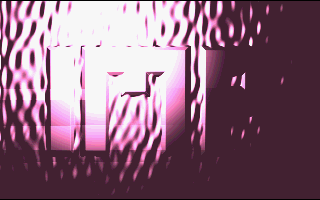

# IMP

A 4K intro for PC, originally released at Quast demo party in 1998. This production scored 4th place in its category during the competition held at 4th Grammar School in Elblag.



[View on Pouet.net](https://www.pouet.net/prod.php?which=58863)

## Overview

IMP is a classic demoscene production that demonstrates the capabilities of pushing creative boundaries within a tiny 4 kilobyte size limit. The intro requires protected mode, linear frame buffer, and VESA to run.

## Running the Intro

Due to its requirements for protected mode and VESA, the recommended way to run this intro on modern systems is using DOSBox-X.

### Setup Instructions

1. Install DOSBox-X on your system
2. Launch DOSBox-X using the provided configuration:
   ```
   dosbox-x -conf dosbox-x.conf
   ```
3. The current directory will be automatically mounted as C:
4. Navigate to the IMP directory:
   ```
   cd IMP
   ```
5. Run the intro:
   ```
   IMP.COM
   ```

## Building from Source

The intro was originally built using Turbo Assembler 4.1. The source code is located in the `IMP` folder.

### Build Instructions

1. If you don't have Turbo Assembler, run the provided shell script to download and extract TASM:
   ```
   ./tasm.sh
   ```

2. Start DOSBox-X with the provided configuration:
   ```
   dosbox-x -conf dosbox-x.conf
   ```

3. Navigate to the IMP directory:
   ```
   cd IMP
   ```

4. Run the build script:
   ```
   make.bat
   ```

## Technical Requirements

- Protected Mode
- Linear Frame Buffer
- VESA support
- 6MB of RAM
- a coprocessor
- DOSBox-X (recommended for modern systems)

## Historical Context

This intro was created as part of the demoscene, a computer art subculture that specializes in producing demos: self-contained, creative audio-visual presentations that show off programming, artistic, and technical skills.

## License

MIT License

Permission is hereby granted, free of charge, to any person obtaining a copy of this software and associated documentation files (the "Software"), to deal in the Software without restriction, including without limitation the rights to use, copy, modify, merge, publish, distribute, sublicense, and/or sell copies of the Software, and to permit persons to whom the Software is furnished to do so, subject to the following conditions:

The above copyright notice and this permission notice shall be included in all copies or substantial portions of the Software.

THE SOFTWARE IS PROVIDED "AS IS", WITHOUT WARRANTY OF ANY KIND, EXPRESS OR IMPLIED, INCLUDING BUT NOT LIMITED TO THE WARRANTIES OF MERCHANTABILITY, FITNESS FOR A PARTICULAR PURPOSE AND NONINFRINGEMENT. IN NO EVENT SHALL THE AUTHORS OR COPYRIGHT HOLDERS BE LIABLE FOR ANY CLAIM, DAMAGES OR OTHER LIABILITY, WHETHER IN AN ACTION OF CONTRACT, TORT OR OTHERWISE, ARISING FROM, OUT OF OR IN CONNECTION WITH THE SOFTWARE OR THE USE OR OTHER DEALINGS IN THE SOFTWARE.

---
*Created in 1998 for the Quast demo party*